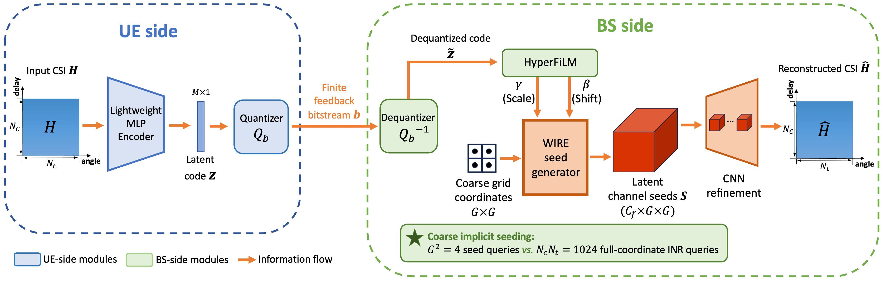

# Q-CFH-Net

Official PyTorch implementation of **Q-CFH-Net: Quantization-Aware Coarse-to-Fine Hybrid Channel Seeding for CSI Feedback**, published in *IEEE Wireless Communications Letters*.

[](https://doi.org/10.1109/LWC.2026.3724567)
[](LICENSE)
[](https://www.python.org/)



## Overview

Q-CFH-Net is a finite-rate CSI feedback model for FDD massive MIMO. The UE encoder compresses the real and imaginary CSI components into a 16-scalar latent representation. Quantization-aware training maps these scalars to 4-bit or 8-bit values, corresponding to 64 or 128 feedback bits. At the BS, the quantized code controls a WIRE-based implicit decoder that predicts a small coarse seed grid. A convolutional refinement cascade then reconstructs the full angular-delay CSI matrix.

The implementation includes:

- split real/imaginary encoders and decoders;
- trainable-scale symmetric uniform scalar quantization with a straight-through estimator;
- coarse-grid WIRE decoding with HyperFiLM conditioning;
- convolutional coarse-to-fine refinement;
- validation-only checkpoint selection and separate final test evaluation;
- NMSE, cosine similarity, physical correlation, and achievable-rate evaluation;
- COST2100 and preprocessed NPZ data loaders.

## Installation

```bash
git clone https://github.com/chenyuma1029/Q-CFH-Net.git
cd Q-CFH-Net
python -m venv .venv
source .venv/bin/activate
pip install -e ".[test]"
```

Run a CPU smoke test without downloading a dataset:

```bash
python scripts/train.py --config configs/smoke.yaml --device cpu
```

## Data

The COST2100 data are not redistributed in this repository. Place the processed files under `data/COST2100/` as described in [data/README.md](data/README.md). The expected input is the conventional CsiNet-format angular-delay CSI representation with shape `[N, 2, 32, 32]`, or its flattened `[N, 2048]` equivalent, stored under the MATLAB key `HT`.

## Training

The paper uses `Nc = Nt = 32`, a total latent dimension of 16, a `2 x 2` coarse seed grid, and 500 epochs. The four COST2100 configurations are in `configs/cost2100/`.

```bash
# Indoor, 4-bit quantization, seed 1
python scripts/train.py \
  --config configs/cost2100/indoor_q4.yaml \
  --seed 1 \
  --experiment-suffix seed1

# Outdoor, 8-bit quantization, seed 1
python scripts/train.py \
  --config configs/cost2100/outdoor_q8.yaml \
  --seed 1 \
  --experiment-suffix seed1
```

Training selects `best.pt` using validation NMSE. The selected checkpoint is then evaluated once on the test split. To run a validation-only experiment that never loads the test split, add `--selection-only`.

## Evaluation

```bash
python scripts/evaluate.py \
  --config configs/cost2100/indoor_q4.yaml \
  --checkpoint checkpoints/qcfh_cost2100_indoor_q4_seed1/best.pt
```

Physical-domain correlation and achievable-rate ratio require the corresponding full frequency-domain COST2100 test file:

```bash
python scripts/evaluate_physical.py \
  --config configs/cost2100/indoor_q4.yaml \
  --checkpoint checkpoints/qcfh_cost2100_indoor_q4_seed1/best.pt \
  --hf-all data/COST2100/DATA_HtestFin_all.mat \
  --out results/indoor_q4_seed1_physical.json
```

Latency, parameter count, and FLOPs can be measured with:

```bash
python scripts/benchmark_latency.py \
  --config configs/cost2100/indoor_q4.yaml \
  --checkpoint checkpoints/qcfh_cost2100_indoor_q4_seed1/best.pt \
  --device cuda \
  --out results/indoor_q4_complexity.json
```

## Main Results

At `eta = 1/128`, Q-CFH-Net obtains the following COST2100 results. Values are mean +/- population standard deviation across three seeds.

| Bits | Scenario | NMSE (dB) | rho | R10 |
|---:|---|---:|---:|---:|
| 4 | Indoor | -4.7656 +/- 0.0223 | 0.7903 +/- 0.0021 | 0.6423 +/- 0.0028 |
| 4 | Outdoor | -4.1840 +/- 0.0118 | 0.7424 +/- 0.0004 | 0.5739 +/- 0.0007 |
| 8 | Indoor | -5.3126 +/- 0.0788 | 0.8108 +/- 0.0033 | 0.6743 +/- 0.0048 |
| 8 | Outdoor | -5.3263 +/- 0.0390 | 0.7932 +/- 0.0015 | 0.6483 +/- 0.0023 |

The complete comparison, per-seed values, complexity measurements, DeepMIMO results, and ablations are available in [`results/`](results/). See [docs/REPRODUCIBILITY.md](docs/REPRODUCIBILITY.md) for the reporting protocol.

## Citation

```bibtex
@article{ma2026qcfhnet,
  author  = {Chenyu Ma and Xuechen Chen and Simin Dai},
  title   = {{Q-CFH-Net}: Quantization-Aware Coarse-to-Fine Hybrid Channel Seeding for {CSI} Feedback},
  journal = {IEEE Wireless Communications Letters},
  year    = {2026},
  doi     = {10.1109/LWC.2026.3724567}
}
```

## License

The code is released under the [MIT License](LICENSE). Dataset licenses and third-party implementations remain with their respective owners.
